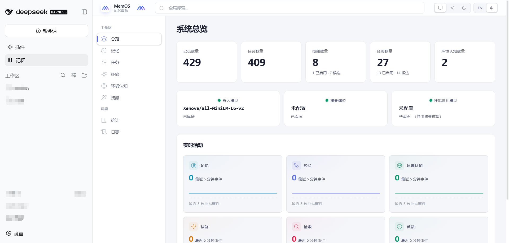
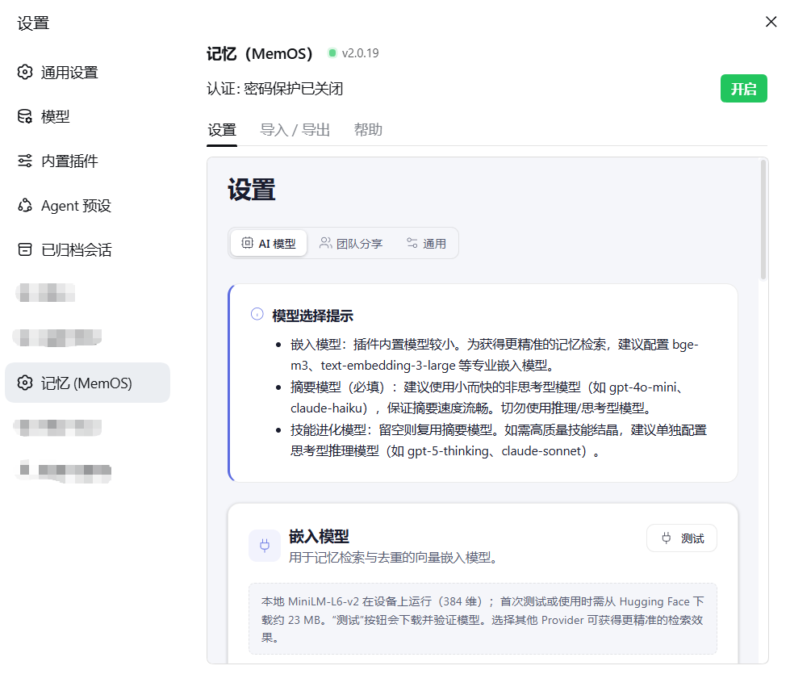

# dsh-memos-local

[English](./README.md) | **简体中文**

> **DSH fork** of `@memtensor/memos-local-plugin`（MemTensor/MemOS）。
> 通过 `git subtree split` 从 MemOS 单体仓库的 `apps/memos-local-plugin`
> 独立出来，完整保留提交历史。
> 由 steven-stack-s 维护，专用于 DeepSeek Harness（DSH）。

## 界面截图

**DSH 侧边栏中的记忆面板** —— 点击左侧「记忆」即可内嵌打开 MemOS 查看器，
记忆浏览与日常 DSH 会话并列，无需切换窗口：



**设置 → 记忆（MemOS）** —— 认证开关、模型状态，以及内嵌的「设置 / 导入导出 / 帮助」页面：



## 安装

### 从 npmjs 安装（推荐 —— 无需任何凭据）

```bash
dsh plugin --profile web add @steven-stack-s/dsh-memos-local
```

`@steven-stack-s/dsh-memos-local` 已发布到公共 npm registry，任何人都可匿名安装：
不需要 token、不需要配置 `.npmrc`、不需要 GitHub 账号。

### 从 GitHub Packages 安装（需要 token）

GitHub Packages 同步了同一版本，但它的 npm registry **即使对 public 包也要求认证**
（这是 GitHub 的既定行为，不是配置错误）。每位用户使用**自己的** token
（任意 GitHub 账号，`read:packages` 权限）：

```bash
# .npmrc —— 把 @steven-stack-s 作用域指向 GitHub Packages
echo '@steven-stack-s:registry=https://npm.pkg.github.com' >> ~/.npmrc
echo '//npm.pkg.github.com/:_authToken=<你自己的_GITHUB_TOKEN>' >> ~/.npmrc

dsh plugin --profile web add @steven-stack-s/dsh-memos-local
```

### 从 git tag 安装（完全不走 registry）

仓库已包含构建产物（`dist/`、`viewer/dist/`），因此从 git 安装无需构建步骤；
适合 registry 被网络限制的场景：

```bash
dsh plugin --profile web add \
  'https://codeload.github.com/steven-stack-s/dsh-memos-local/tar.gz/refs/tags/v<版本>'
```

> `github:owner/repo#tag` 也可以，但它需要通过 git 协议访问 `github.com` 解析 ref；
> 上面的 codeload 链接只需 `codeload.github.com` 可达。

## 版本策略

**版本号由两部分组成：上游基线 + 本地修订号。**

```
<上游版本> - dsh.<本地修订号>
   2.0.19   -     dsh.1
```

- `2.0.19` 是本 fork 所同步的上游 `@memtensor/memos-local-plugin` 版本，
  表示*算法与上游哪一版对齐*。
- `-dsh.N` 是**本 fork 自己的修订计数器**，在同一上游基线内每发一次
  fork 专属改动就递增（`2.0.19-dsh.1`、`2.0.19-dsh.2`……）；
  切换到新的上游基线时重置为 `dsh.1`（`2.0.20-dsh.1`）。

### 为什么用 `-dsh.N` 而不是 `+dsh.N`

`-dsh.N` 是 semver 的 **prerelease** 语法。prerelease 排在正式版**之下**：
`2.0.19-dsh.1 < 2.0.19`。这是实打实的代价，见下方「注意：范围匹配」。

看起来更优的选择是 build metadata（`2.0.19+dsh.1`）——它在优先级比较中被忽略，
所以 `2.0.19+dsh.1` 仍然满足 `^2.0.19`。**但它不可用。** 该方案曾实现并对真实
registry 实测，结果证明 npm 会在发布路径上剥掉 `+` 段：

```
package.json          "version": "2.0.19+dsh.1"
npm publish 实际产出   npm notice version: 2.0.19
                      npm notice filename: ...-2.0.19.tgz
registry 收到的 PUT    https://registry.npmjs.org/@steven-stack-s%2fdsh-memos-local
                      -> 400 Cannot publish over previously published version "2.0.19"
```

我们要发布的版本号，和 npm 实际发布的版本号不是同一个，因此 build metadata
无法用来把 fork 发布与上游版本号区分开。prerelease 语法能完整穿过发布路径，
这是这里选用它的唯一原因。

### tag ⇄ 版本号映射

git tag 就是 `v` + 版本号本身，不做任何变换：

| `package.json` 版本 | git tag |
| --- | --- |
| `2.0.19-dsh.1` | `v2.0.19-dsh.1` |
| `2.0.19-dsh.2` | `v2.0.19-dsh.2` |
| `2.0.20-dsh.1` | `v2.0.20-dsh.1` |

两个发布 workflow 都会校验 tag 与 `package.json.version` 是否一致，不一致直接失败。

### 注意：范围匹配

因为 prerelease 排在正式版之下，**`2.0.19-dsh.1` 不满足 `^2.0.19`**——
npm 的 semver 会把 prerelease 排除在范围匹配之外，除非范围自身就点明了同一
元组上的 prerelease。后果：

- 写成 `"^2.0.19"` 的依赖**不会**解析到 `2.0.19-dsh.1`。
- 请按**精确版本**安装（`2.0.19-dsh.1`），或走 dist-tag（`latest` 总是指向
  最新已发布版本，不受范围规则影响），或直接用 `dsh plugin add`——它按名字
  直接安装指定包。

对本 fork 的分发方式来说这是可接受的：使用者是**按包名安装**，而不是把它作为
caret 范围的依赖引入。若将来确实需要能被范围匹配到，就发一个非 prerelease 的
版本号，或让使用方依赖 `latest`。

### 为什么需要本地修订号

因为 **npm 的版本号是永久的**。发布并不像看起来那样可逆：`npm unpublish`
删掉的是*产物*，版本号本身仍然作废——registry 会在 packument 的 `time` 表里
留下墓碑，之后任何对该号的发布都会被拒绝：

```
400 Cannot publish over previously published version "2.0.19"
```

所以复用上游版本号会**永久消耗**它。若严格跟随上游版本号，这个 fork 迟早会
无号可发。`-dsh.N` 序列让每次 fork 发布都有一个全新的、从未被占用的版本号。

### 升级步骤

```bash
# 1. 改 package.json 的 version
#      同一基线上的 fork 改动:  2.0.19-dsh.1 -> 2.0.19-dsh.2
#      同步到新的上游版本:       2.0.20-dsh.1
node -e "
  const fs = require('fs');
  const p = JSON.parse(fs.readFileSync('package.json', 'utf8'));
  p.version = '2.0.19-dsh.2';            // <-- 改这里
  fs.writeFileSync('package.json', JSON.stringify(p, null, 2) + '\n');
"
# 2. 刷新入库的构建产物
npm run build:package
# 3. 提交、打 tag
git commit -am 'chore(release): v2.0.19-dsh.2'
git tag -a v2.0.19-dsh.2 -m 'v2.0.19-dsh.2'
git push origin main --tags
```

> 推 tag 只会跑一次**打包 dry-run 校验**。真正发布需要手动触发
> `workflow_dispatch` 并把 `dry_run` 设为 `false`。详见各 workflow 文件内的说明。

## 与上游的关系（subtree 同步）

本仓库用 `git subtree split` 从 **MemTensor/MemOS** 单体仓库的
`apps/memos-local-plugin` 独立出来，保留了该子目录的完整提交历史。
同步上游 core 算法更新：

```bash
# remote "upstream" 已配置（只读）。拉取上游一棵完整的 monorepo tree：
git fetch upstream
# 把上游最新的 apps/memos-local-plugin 结点合并进来（subtree 合并）：
git subtree merge --squash -P . upstream/<branch>
# 或更精确地，用 --prefix 提取上游该子目录的最新内容后整体整合。
```

> 说明：core 算法逻辑尽量少改，以便 subtree 合并冲突最小化。
> DSH 相关的改动集中在 `adapters/deepseek-harness/`、`client/`、
> `package.json`（`exports`）等"发行层"；这些文件的冲突在合并时需要人工留意。

## 这是什么

一套**本地优先、基于文件**的记忆系统，为智能体提供四层协作记忆，以及一套
由反馈驱动的"自我进化"循环：

- **L1 trace（轨迹）**——逐步的落地记录（动作 + 观测 + 反思 + 价值）。
- **L2 policy（策略）**——跨多条轨迹归纳出的子任务策略。
- **L3 world model（世界模型）**——由 L2 + L1 推导出的压缩环境认知。
- **Skill（技能）**——可直接调用的、被结晶的可执行能力。

插件从两条反馈通道持续学习：

- **步骤级**——模型 ↔ 环境（工具结果、观测差异）。
- **任务级**——人 ↔ 模型（显式评分 + 隐式信号）。

反思加权的奖励会沿每条轨迹反向传播，高价值的模式结晶为可复用的 Skill。
推理时，一个**三层检索器**（Skill → trace/episode → world model）在正确的
时机注入正确的上下文。

## 目录结构（概览）

```
adapters/deepseek-harness/ # DSH 的 Cordis 插件（服务端）——本 fork 唯一的适配器
agent-contract/            # 与各适配器共享的稳定类型与 JSON-RPC 协议
core/                      # 与智能体无关的核心算法（记忆、奖励、检索、技能…）
server/                    # HTTP + SSE 服务（驱动 viewer）
client/                    # DSH 浏览器端 bundle（记忆页签、设置项）
viewer/                    # 运行时 Viewer（Vite，由 server/ 提供）
templates/                 # 安装时复制到用户主目录的 config.yaml 模板
docs/                      # 面向开发者的文档（算法、数据模型、提示词…）
scripts/                   # 构建 / 打包 / 发布辅助脚本
tests/                     # 单元 / 集成 / e2e（vitest）
```

完整的结构说明见 [ARCHITECTURE.md](./ARCHITECTURE.md)。

## 数据在哪里

运行时代码与用户状态是分开的。DSH 通过 `dsh plugin` 把包安装到 profile，
并在首次 boot 时初始化其运行时 home：

| 智能体 | 代码安装到 | 运行时数据 + 配置在 |
| --- | --- | --- |
| DeepSeek Harness | 由 `dsh plugin` 管理，为 profile 依赖 | `$DSH_HOME/memos-plugin/`（默认 `~/.dsh/memos-plugin/`） |

运行时目录内部：

```
config.yaml      # MemOS core 配置（含 API key；写入时 chmod 600）
data/memos.db    # SQLite（L1/L2/L3/Skill/Episode/Feedback/…）
skills/          # 结晶后的技能包
logs/            # 轮转日志（memos.log, error.log, audit.log, …）
```

DSH 在 **DSH 的 Node.js 进程内**直接运行 `MemoryCore` 和现有的 HTTP/SSE
Viewer，**不需要** JSON-RPC bridge 或 sidecar 守护进程。卸载插件**不会**删除
`data/`、`skills/`、`logs/`、`config.yaml`。升级后启动时可能迁移 SQLite
schema，升级前请备份运行时目录。

## 快速开始（DSH）

> [!IMPORTANT]
> **不要执行 `npm install -g @memtensor/memos-local-plugin`。**
> 这是智能体插件包，不是独立 CLI。请用 DSH 的包管理（`dsh plugin`）或
> 安装器的 `--agent dsh` 目标。

DSH 支持是一个"out-of-tree"的 Cordis bundle。一键安装器把包所有权与 bundle
协调交给 `dsh plugin`，同时处理 pnpm 的"已评审原生依赖构建"策略（无需
人工批准 `--approve-builds`）：

```bash
curl -fsSL https://raw.githubusercontent.com/MemTensor/MemOS/main/apps/memos-local-plugin/install.sh \
  | bash -s -- --agent dsh --profile web --version 2.0.19
```

> 这里的 `--version 2.0.19` 指的是**上游** `@memtensor/memos-local-plugin` 的版本，
> 不是本 fork 的版本。该安装器位于上游仓库、安装的是上游包；本 fork 发布的是
> 自己的 `@steven-stack-s/dsh-memos-local`，版本形如 `<上游版本>-dsh.<n>`
> （见[版本策略](#版本策略)）。

如果 `pnpm` 不在 `PATH` 上，它会为该次安装准备一个隔离的 `pnpm@11.7.0`，
不改动用户的全局包管理器设置；安装器退出时会移除这个临时 pnpm。

从本地 checkout 开发，则构建后直接加进目标 DSH profile：

```bash
cd /path/to/dsh-memos-local
npm install
npm run build
dsh plugin --profile web add .
```

### DSH 记忆页签与 Viewer

DSH 适配器默认把 Viewer（默认监听 `127.0.0.1:18801`）以 **`/memos`**
前缀挂到 **DSH 自己的 Web 服务器**上，因此你可以：

- 在 DSH 左侧栏的**「Memory」页签**中直接查看记忆内容（iframe 内嵌同源
  `/memos/`，无 Mixed-Content 问题）。
- 直接在浏览器打开（需先登录 DSH）：
  `https://<你的DSH域名>/memos/`

`/memos` 反代由 adapter 在 Viewer 启动后自动注册到 DSH 的 `webServer`；
它会注入 `<base href="/memos/">` 并劫持前端 `fetch`/`XHR`/`EventSource`，
让 Viewer 的绝对路径 `/api/v1/...` 正确落到 `/memos/api/v1/...`。

**DSH 记忆页签**（浏览器端）由 `client/client.js` 注册三块 UI：

| 界面 | Slot | 说明 |
|---|---|---|
| 主面板 | `main`（key=`memos`） | iframe 内嵌 `/memos/` 记忆查看器 |
| 侧边栏入口 | `sidebar.panellist`（id=`memos`） | 「Memory」按钮，与对话/轨迹并列 |
| 设置项 | `settings.section` | 「Memory (Memos)」配置 + Viewer 状态 |

> 记忆查看器若启用了**密码保护**，首次进入时需在 Viewer 界面内输入你设置的
> 密码。这与 DSH 的登录是两套独立的认证。

### DSH 记忆检索策略

- 每个被接受的非空直接用户回合执行**一次自动 recall**，包括问候与恢复的会话。
- 检索结果以 `memos-local-memory` 标签、排在 query 之前注入上下文。
- 模型还可额外调用 `memos_search` 做更短/改写的查询。
- 自动 recall 与 `memos_search` 共享同一绝对截止时间
  `min(recallTimeoutMs, 3000)` ms（默认 3000ms，只能缩短不能延长）。
- 捕获、关系、意图、摘要、embedding 都是后台工作，下一回合不会等待
  上一回合的队列。

## 配置

共享的 MemOS core 从运行时目录读取 `config.yaml`。DSH 的控制项
（如 `viewerEnabled`、`viewerPort`）在 profile 的 Cordis 行里；共享的
Viewer 设置（如 `viewer.bindHost`）留在 `config.yaml`。运行时/配置位置按
以下优先级解析：

1. **`MEMOS_HOME`** 环境变量 —— 运行时根目录
2. **`MEMOS_CONFIG_FILE`** 环境变量 —— 直接指向配置文件
3. **适配器显式 home** —— DSH Cordis 行的 `home` 字段
4. **`DSH_HOME`** —— 默认 DSH 记忆根为 `$DSH_HOME/memos-plugin/`
5. **默认路径** —— `~/.dsh/memos-plugin/`

## 故障排查

- **`npm install -g @memtensor/memos-local-plugin` 提示 404**：可能是不小心把
  插件当独立 CLI 全局安装。请改用 `dsh plugin`（如上方所示）。
- **`web/` 或 `site/` 目录只有 README**：这些是过期目录名。运行时 viewer
  源码在 `viewer/`。若看到只有 README 的目录，说明你在看一个已发布的 npm
  tarball，而非本仓库的完整源码。

## 开发者文档

见 [docs/](./docs/README.md) ——算法、数据模型、提示词、日志等文档的索引。

另见 [DeepSeek Harness 适配器指南](./adapters/deepseek-harness/README.md)
——Node 兼容性、`DSH_HOME`、重启/卸载步骤、viewer 生命周期、已评审的
pnpm 批准流程。
